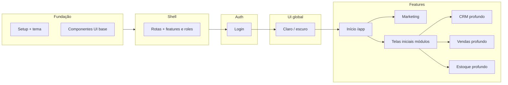

# Plano de implementação (frontend)

Plano **incremental**: cada fase entrega valor testável. **Nesta etapa do projeto, toda tela usa dados mockados** (ver `SPEC.md` §2.1); integração com o backend (`be`, repositório irmão) virá depois. **Todas as telas devem ser responsivas** — clientes acessam pelo celular (`SPEC.md` §6). Ordem sugerida considera dependências (tema e shell antes das features) e uso de **npm** como gerenciador de pacotes. **Prioridade atual:** depois do dashboard (`/app`) e do marketing interno, **telas iniciais** de cada módulo com referência visual (**Fase 8**) vêm **antes** do CRM/Vendas/Estoque **profundos** (Fases 9–11).

## Visão das fases por parte do projeto

*(Mermaid é opcional no visualizador; o texto abaixo é a fonte de verdade.)*

---

## Fase 0 — Documentação e convenções

- [ ] Manter `docs/SPEC.md` atualizado quando novas telas ou regras forem definidas.
- [ ] Registrar no repositório decisões de pastas (`features/`, `components/ui/`, etc.) no README ou em ADR curto se necessário.
- [ ] Ao definir novas rotas, alinhar com **§5** do spec (feature + role por rota).
- [ ] Novas telas: dados via **mock** na camada de serviço/hook, nunca dependência direta ao `be` até a fase de integração.
- [ ] Mudanças notáveis: atualizar **`CHANGELOG.md`** conforme **§7.1** do spec.
- [ ] **`README.md`:** atualizar a lista de **funcionalidades em produção para o cliente** apenas quando algo for **implantado em produção** — não usar essa lista para trabalho em desenvolvimento (§7.1).
- [ ] Novas telas e layouts: verificar **uso em mobile** (largura estreita, toque), conforme **§6** do spec.

**Saída:** spec e plan alinhados com o time.

---

## Fase 1 — Fundação do projeto (npm + Vite + React + TS)

**Objetivo:** repositório executável com lint/format mínimos e tema global.

**Passos:**

1. Criar app com Vite (template React + TypeScript), instalar dependências com **npm**.
2. Adicionar `bootstrap`, `react-bootstrap`, `react-router-dom`.
3. Criar `src/styles/` com arquivo de **tokens/tema** (ex.: variáveis CSS para primária marsala, cinzas, e mapeamento para `--bs-primary` onde aplicável).
4. Estruturar pastas: `components/ui`, `components/layout`, `app` (providers, router), `features/` por módulo, e **`mocks/` ou `services/mock/`** para dados falsos compartilhados.
5. Página inicial placeholder que já usa o tema.
6. Criar **`CHANGELOG.md`** na raiz (formato acordado no repo) e, na primeira entrega, registrar a fundação do projeto.

**Saída:** `npm run dev` com tema aplicado; estrutura de pastas criada, incluindo local para mocks; changelog iniciado.

---

## Fase 2 — Biblioteca de componentes base

**Objetivo:** primitivos reutilizáveis para não duplicar Bootstrap nas telas.

**Passos:**

1. Wrappers: botão, input, card, modal, alert/toast (o que for necessário para as próximas fases).
2. Componentes de layout: `PageHeader`, `EmptyState`, container de página.
3. Padronizar importações e variantes (ex.: `variant` mapeada para tokens).
4. Garantir que primitivos e containers funcionem bem em **viewport estreita** (empilhamento, largura total, sem overflow horizontal desnecessário).

**Saída:** telas futuras só compõem estes componentes; base pronta para mobile.

---

## Fase 3 — Roteamento, shell e controle de acesso (features + roles)

**Objetivo:** layout logado, **registro central de rotas** e guardas alinhadas ao **§5** do spec (módulos por pacote + `admin` / `common`).

**Passos:**

1. Definir rotas: `/login`, `/` (marketing ou redirect), `/app/...` para módulos internos; cada rota declarada com **feature** e **roles** exigidos (ver chaves `crm`, `vendas`, `estoque`, etc.).
2. **Mocks** até existir API: `enabledFeatures` (tenant) e `role` do usuário (`admin` | `common`); provider/hook (ex.: `useAccess()`).
3. Componentes ou wrappers de rota: **bloqueio por URL** se feature desligada ou papel insuficiente (redirecionamento ou página 403 amigável — decidir padrão e documentar).
4. **Menu** (sidebar/navbar) gerado a partir do mesmo registro de rotas ou mapa derivado — sem duplicar regras em vários arquivos; **menu colapsável** em telas pequenas (padrão Bootstrap).
5. Rotas protegidas: sessão mock de “usuário logado” até integração real.
6. Revisar shell e páginas stub em **largura de celular** (~360px).

**Saída:** navegação entre seções coerente com pacote simulado; deep link para módulo não contratado não expõe tela de módulo; uso aceitável em smartphone.

---

## Fase 4 — Feature: Login

**Objetivo:** tela de autenticação alinhada ao spec §4.1.

**Passos:**

1. UI final do formulário (validação client-side básica).
2. Integração mock: sucesso redireciona para `/app`; falha exibe mensagem.
3. Mock de sessão deve incluir **`role`** e lista de **`enabledFeatures`** (ou equivalente) para alimentar guardas da Fase 3 — espelhar contrato futuro da API.
4. Preparar hook ou serviço `auth` para trocar mock por chamada HTTP depois.

**Saída:** fluxo login → área logada testável manualmente; sessão mock utilizável por features e roles.

---

## Fase 5 — Tema claro / escuro (toggle global)

**Objetivo:** o utilizador alternar **modo claro** e **modo escuro** em **todas** as páginas (área logada, login e home pública), com preferência **persistida** — mais simples de manter se a base (Bootstrap `data-bs-theme`, tokens CSS) estiver definida **antes** de encher módulos com telas complexas.

**Passos:**

1. **Provider** (ex.: `ThemeProvider`) + hook `useTheme()` com valores `light` | `dark` (ou `system` opcional depois).
2. Aplicar no **documento** (ex.: `document.documentElement.setAttribute('data-bs-theme', …)`), alinhado ao [color modes do Bootstrap 5.3](https://getbootstrap.com/docs/5.3/customize/color-modes/).
3. **Persistência:** `localStorage` (chave estável, ex.: `ir_theme`) para restaurar após refresh.
4. **Toggle** visível no **topo** da UI em todas as rotas principais: colocar no **shell** (`AppShell`) e num **mini-bar** ou canto da **home** e da **login** (mesmo componente reutilizado, ex.: `ThemeToggle` em `components/ui/`).
5. Rever **`theme.css`** e **`login.css`:** variáveis para superfície/texto em ambos os modos; evitar cores fixas que quebrem no modo escuro na área logada (Navbar, `PageContainer`, etc.).
6. Testar **contraste** e leitura nos dois modos (ligação ao §6 — responsivo continua obrigatório).

**Saída:** um único lugar controla o modo; novas telas herdam automaticamente se usarem Bootstrap/tokens.

---

## Fase 6 — Tela de início (dashboard em `/app`)

**Objetivo:** após o login, o utilizador ver um **painel de início** coerente com a marca (saudação, acesso rápido aos módulos do pacote, elementos opcionais como onboarding e complementos), em **mobile e desktop**, antes de investir nas telas profundas de cada módulo.

**Contexto:** a prioridade desta fase foi **adiantada** em relação ao plano original (em que “Marketing público” vinha primeiro). O **site marketing** passou para a **Fase 7**.

**Passos:**

1. Layout da rota **`/app`** (index): hero de boas-vindas, cópias configuráveis (ex.: `mocks`), grelha de cartões alinhada a **`APP_CHILD_ROUTES`** (Marketing, CRM, Vendas, Estoque) com ícones discretos e respeito a `hasFeature` / pacote mock.
2. Blocos opcionais: onboarding (progresso, dispensável), secção “Complementos”, FAB ou atalho de suporte (podem ficar placeholder até integração).
3. Estilos dedicados (ex.: `app-dashboard.css`) usando tokens de **`theme.css`** — sem cores fixas que quebrem no modo escuro.
4. Responsividade: cartões empilham em ecrã estreito; conteúdo acessível sem scroll horizontal desnecessário.

**Saída:** utilizador autenticado reconhece o contexto da clínica e abre módulos permitidos a partir do início; base visual alinhada à referência de produto (ex.: dashboard tipo “Ryka”).

---

## Fase 7 — Feature: Marketing

Marketing divide-se em **dois entregáveis** no spec (§4.2): **área logada** (campanhas/metas) e **site público** (landing). Podem avançar em paralelo no código; aqui a ordem reflete o que já existe na rota `/app/marketing`.

### 7.1 Área logada — campanhas e metas (`/app/marketing`)

**Objetivo:** tela interna de marketing com dados mock, alinhada ao pacote `marketing` e guardas existentes.

**Passos:**

1. [x] Meta anual e visão mensal (Jan–Dez): real vs projetado vs meta; barra de progresso.
2. [x] Lista/tabela de campanhas com busca client-side; colunas de estratégia, leads, meta/realizado, progresso.
3. [x] Ações de linha e “Nova campanha” como placeholders desativados até haver API.
4. [x] Layout responsivo e estilos dedicados (`marketing-page.css`).

**Saída:** utilizador autenticado com feature `marketing` acede a `/app/marketing` e vê metas e campanhas mock.

### 7.2 Site público (institucional)

**Objetivo:** páginas públicas conforme spec §4.2 (sem login).

**Passos:**

1. [ ] Layout marketing (sem menu administrativo ou com header simplificado).
2. [ ] Landing com seções genéricas (serviços, contato); dados estáticos ou JSON local.
3. [ ] Rota pública clara (ex.: `/` dedicado ao site, ou `/site`, conforme decisão — hoje `/` pode ser home técnica; alinhar com o spec).

**Saída:** visitante vê marketing sem autenticação.

---

## Fase 8 — Telas iniciais dos módulos (referência visual / prints)

**Objetivo:** para cada rota de módulo já registada (ex.: `/app/crm`, `/app/vendas`, `/app/estoque` em `APP_CHILD_ROUTES` / `routeMeta.ts`), entregar a **primeira tela** com layout, hierarquia visual e dados **mock**, alinhada a **prints ou referências** enviadas pelo produto — trabalho **print a print** até cobrir o escopo acordado.

**Contexto:** esta fase foi **priorizada** em relação ao desenvolvimento **profundo** de CRM, Vendas e Estoque (listas completas, CRUD, fluxos longos), que ficam nas **Fases 9–11**. O **7.2** (site público / landing) pode seguir o **mesmo processo** (referência visual) nesta fase ou permanecer independente, conforme prioridade do time.

**Passos:**

1. [ ] Inventário das rotas e páginas atuais em `src/pages/app/` (substituir placeholders onde couber).
2. [ ] **Por módulo** (ordem combinada com o produto): receber print ou referência → implementar **tela inicial** → validar **responsivo** e **tema claro/escuro** → registo no `CHANGELOG` quando a tela for aceite.
3. [ ] Dados sempre via mocks até integração com API (§2.1 do spec).
4. [ ] Opcional na mesma lógica: **7.2** (landing pública) ou ajustes pontuais em telas já existentes (ex.: marketing interno), se a referência exigir.

**Entregas parciais (tela inicial):**

- [x] **Vendas** — rota `/app/vendas`, vista **Transações** (KPIs, mês/ano, busca, tabela mock, sidebar do módulo); `VendasPage.tsx`, `mocks/vendas.ts`.

**Fora do âmbito desta fase:** CRUD completo, filtros avançados, integração HTTP — isso entra nas **Fases 9–11** e na **Fase 12** (qualidade/API).

**Saída:** cada módulo em escopo tem uma **tela inicial** utilizável e alinhada à referência visual; base para evoluir nas fases seguintes.

---

## Fase 9 — Feature: CRM (dados ricos e CRUD)

**Nota:** a **tela inicial** do CRM (layout principal após abrir o módulo) deve estar endereçada na **Fase 8**; esta fase cobre **evolução** para dados ricos e fluxos completos.

**Objetivo:** primeiro módulo de dados “ricos” conforme spec §4.3.

**Passos:**

1. Lista de contatos com dados mock (array em memória ou JSON).
2. Tela de detalhe + formulário criar/editar (estado local ou mock API).
3. Opcional: filtros simples e busca.

**Saída:** CRUD mínimo de contatos demonstrável.

---

## Fase 10 — Feature: Vendas (dados ricos e fluxos)

**Nota:** a **tela inicial** de Vendas fica na **Fase 8**; aqui entram orçamentos, listas e fluxos completos.

**Objetivo:** orçamentos/oportunidades conforme spec §4.4.

**Passos:**

1. Lista de vendas/orçamentos com status.
2. Detalhe com itens e totais (mock).
3. Criação de registro mínimo (sem integração fiscal).

**Saída:** fluxo lista → detalhe → criar (mock) funcional.

---

## Fase 11 — Feature: Estoque (dados ricos e movimentações)

**Nota:** a **tela inicial** de Estoque fica na **Fase 8**; aqui entram itens, histórico e ajustes completos.

**Objetivo:** itens e movimentações conforme spec §4.5.

**Passos:**

1. Lista de itens com quantidade.
2. Detalhe com histórico de movimentos (mock).
3. Ação de entrada/saída/ajuste com atualização do estado mock.

**Saída:** controle simplificado demonstrável.

---

## Fase 12 — Qualidade e preparação para API

**Objetivo:** endurecer antes de integrar o repositório **backend** (quando existir); até lá o app permanece 100 % em mocks.

**Passos:**

1. ESLint/Prettier consistentes com o projeto.
2. Extrair tipos TypeScript compartilhados (`types/`) para entidades usadas em CRM/Vendas/Estoque, **papéis** e **features** habilitadas (contrato com backend).
3. Camada `api/` ou `services/` com funções que hoje retornam mocks; trocar implementação depois.
4. Testes (opcional): componentes críticos, hooks e **guardas de rota** (cenários feature off / role errado).
5. Smoke manual ou checklist de **regressão visual** em mobile para fluxos principais.

**Saída:** projeto pronto para substituir mocks por chamadas HTTP; **contrato de sessão** (features habilitadas + `role`) refletido em tipos e serviços; critérios de responsividade documentados no spec.

---

## Ordem resumida

| Ordem | Parte do projeto |
|-------|-------------------|
| 1 | Fundação (npm, Vite, tema, pastas) |
| 2 | Componentes UI base |
| 3 | Shell + rotas + guardas (features / roles) |
| 4 | Login |
| 5 | **Tema claro / escuro (toggle global + persistência)** |
| 6 | **Tela de início / dashboard (`/app`)** |
| 7 | **Marketing** — interno (`/app/marketing`) **feito** · público (landing) **pendente** |
| 8 | **Telas iniciais** dos módulos (prints / referência visual) — CRM, Vendas, Estoque (+ opcional 7.2) |
| 9 | CRM — dados ricos, CRUD e fluxos completos |
| 10 | Vendas — dados ricos e fluxos completos |
| 11 | Estoque — dados ricos e movimentações completas |
| 12 | Qualidade + camada de API mock |

---

## Processo de atualização (alinhado ao `SPEC.md`)

Ao receber novas informações de produto ou prioridade:

1. Atualizar **`docs/SPEC.md`** e este **`docs/PLAN.md`**.
2. Conferir no **código** se a mudança afeta algo **já implementado**. Se afetar, anotar tarefa de **refatoração/alinhamento** para o código seguir o documento (ver também §7 do spec — processo de atualização).
3. **CHANGELOG** e **README:** seguir **§7.1** do spec — changelog para histórico de versões; README (funcionalidades para o cliente) só quando houver **produção** para o cliente.

---

## Histórico de revisões

| Data | Alteração |
|------|-----------|
| *(inicial)* | Plano por fases com módulos Login, Marketing, CRM, Vendas, Estoque. |
| 2026-04-17 | Intro (responsivo); Fase 0/2/3/9 mobile; §2.1; Processo §7; README vs changelog. |
| 2026-04-17 | Nova **Fase 5** tema claro/escuro; Marketing→6 … Estoque→9; Qualidade→10; mermaid atualizado. |
| 2026-04-18 | **Fase 6** redefinida: **tela de início** (`/app`) com prioridade; **Marketing público**→**7**; CRM→**8**; Vendas→**9**; Estoque→**10**; Qualidade→**11**; diagrama e tabela atualizados. |
| 2026-04-19 | **Fase 7** dividida em **7.1** (marketing interno em `/app/marketing`, entregue) e **7.2** (site público, pendente); tabela “Ordem resumida” atualizada. |
| 2026-04-19 | Nova **Fase 8** — **telas iniciais** (referência visual / prints), priorizada antes dos módulos profundos; **CRM / Vendas / Estoque / Qualidade** renumerados para **9–12**; diagrama mermaid atualizado. |
| 2026-04-19 | Fase 8: entrega **Vendas / Transações** (`/app/vendas`); secção *Entregas parciais* no plano. |
