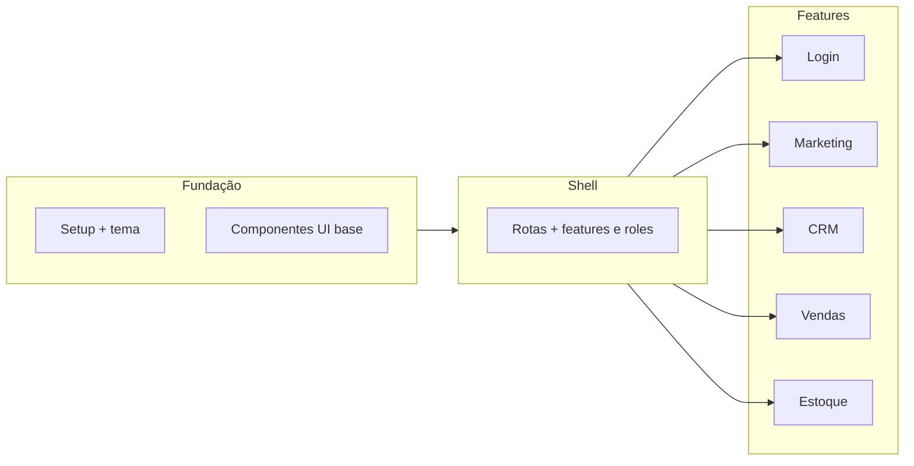

# Plano de implementação (frontend)

Plano **incremental**: cada fase entrega valor testável. **Nesta etapa do projeto, toda tela usa dados mockados** (ver `SPEC.md` §2.1); integração com o backend (`be`, repositório irmão) virá depois. Ordem sugerida considera dependências (tema e shell antes das features) e uso de **npm** como gerenciador de pacotes.

## Visão das fases por parte do projeto

*(Mermaid é opcional no visualizador; o texto abaixo é a fonte de verdade.)*

---

## Fase 0 — Documentação e convenções

- [ ] Manter `docs/SPEC.md` atualizado quando novas telas ou regras forem definidas.
- [ ] Registrar no repositório decisões de pastas (`features/`, `components/ui/`, etc.) no README ou em ADR curto se necessário.
- [ ] Ao definir novas rotas, alinhar com **§5** do spec (feature + role por rota).
- [ ] Novas telas: dados via **mock** na camada de serviço/hook, nunca dependência direta ao `be` até a fase de integração.
- [ ] Mudanças notáveis: atualizar **`CHANGELOG.md`** conforme **§7.1** do spec.
- [ ] **`README.md`:** atualizar a lista de **funcionalidades em produção para o cliente** apenas quando algo for **implantado em produção** — não usar essa lista para trabalho em desenvolvimento (§7.1).

**Saída:** spec e plan alinhados com o time.

---

## Fase 1 — Fundação do projeto (npm + Vite + React + TS)

**Objetivo:** repositório executável com lint/format mínimos e tema global.

**Passos:**

1. Criar app com Vite (template React + TypeScript), instalar dependências com **npm**.
2. Adicionar `bootstrap`, `react-bootstrap`, `react-router-dom`.
3. Criar `src/styles/` com arquivo de **tokens/tema** (ex.: variáveis CSS para primária marsala, cinzas, e mapeamento para `--bs-primary` onde aplicável).
4. Estruturar pastas: `components/ui`, `components/layout`, `app` (providers, router), `features/` por módulo, e **`mocks/` ou `services/mock/`** para dados falsos compartilhados.
5. Página inicial placeholder que já usa o tema.
6. Criar **`CHANGELOG.md`** na raiz (formato acordado no repo) e, na primeira entrega, registrar a fundação do projeto.

**Saída:** `npm run dev` com tema aplicado; estrutura de pastas criada, incluindo local para mocks; changelog iniciado.

---

## Fase 2 — Biblioteca de componentes base

**Objetivo:** primitivos reutilizáveis para não duplicar Bootstrap nas telas.

**Passos:**

1. Wrappers: botão, input, card, modal, alert/toast (o que for necessário para as próximas fases).
2. Componentes de layout: `PageHeader`, `EmptyState`, container de página.
3. Padronizar importações e variantes (ex.: `variant` mapeada para tokens).

**Saída:** telas futuras só compõem estes componentes.

---

## Fase 3 — Roteamento, shell e controle de acesso (features + roles)

**Objetivo:** layout logado, **registro central de rotas** e guardas alinhadas ao **§5** do spec (módulos por pacote + `admin` / `common`).

**Passos:**

1. Definir rotas: `/login`, `/` (marketing ou redirect), `/app/...` para módulos internos; cada rota declarada com **feature** e **roles** exigidos (ver chaves `crm`, `vendas`, `estoque`, etc.).
2. **Mocks** até existir API: `enabledFeatures` (tenant) e `role` do usuário (`admin` | `common`); provider/hook (ex.: `useAccess()`).
3. Componentes ou wrappers de rota: **bloqueio por URL** se feature desligada ou papel insuficiente (redirecionamento ou página 403 amigável — decidir padrão e documentar).
4. **Menu** (sidebar/navbar) gerado a partir do mesmo registro de rotas ou mapa derivado — sem duplicar regras em vários arquivos.
5. Rotas protegidas: sessão mock de “usuário logado” até integração real.

**Saída:** navegação entre seções coerente com pacote simulado; deep link para módulo não contratado não expõe tela de módulo.

---

## Fase 4 — Feature: Login

**Objetivo:** tela de autenticação alinhada ao spec §4.1.

**Passos:**

1. UI final do formulário (validação client-side básica).
2. Integração mock: sucesso redireciona para `/app`; falha exibe mensagem.
3. Mock de sessão deve incluir **`role`** e lista de **`enabledFeatures`** (ou equivalente) para alimentar guardas da Fase 3 — espelhar contrato futuro da API.
4. Preparar hook ou serviço `auth` para trocar mock por chamada HTTP depois.

**Saída:** fluxo login → área logada testável manualmente; sessão mock utilizável por features e roles.

---

## Fase 5 — Feature: Marketing

**Objetivo:** páginas públicas conforme spec §4.2.

**Passos:**

1. Layout marketing (sem menu administrativo ou com header simplificado).
2. Landing com seções genéricas (serviços, contato); dados estáticos ou JSON local.
3. Rota pública clara (ex.: `/` ou `/site`).

**Saída:** visitante vê marketing sem autenticação.

---

## Fase 6 — Feature: CRM

**Objetivo:** primeiro módulo de dados “ricos” conforme spec §4.3.

**Passos:**

1. Lista de contatos com dados mock (array em memória ou JSON).
2. Tela de detalhe + formulário criar/editar (estado local ou mock API).
3. Opcional: filtros simples e busca.

**Saída:** CRUD mínimo de contatos demonstrável.

---

## Fase 7 — Feature: Vendas

**Objetivo:** orçamentos/oportunidades conforme spec §4.4.

**Passos:**

1. Lista de vendas/orçamentos com status.
2. Detalhe com itens e totais (mock).
3. Criação de registro mínimo (sem integração fiscal).

**Saída:** fluxo lista → detalhe → criar (mock) funcional.

---

## Fase 8 — Feature: Estoque

**Objetivo:** itens e movimentações conforme spec §4.5.

**Passos:**

1. Lista de itens com quantidade.
2. Detalhe com histórico de movimentos (mock).
3. Ação de entrada/saída/ajuste com atualização do estado mock.

**Saída:** controle simplificado demonstrável.

---

## Fase 9 — Qualidade e preparação para API

**Objetivo:** endurecer antes de integrar o repositório **backend** (quando existir); até lá o app permanece 100 % em mocks.

**Passos:**

1. ESLint/Prettier consistentes com o projeto.
2. Extrair tipos TypeScript compartilhados (`types/`) para entidades usadas em CRM/Vendas/Estoque, **papéis** e **features** habilitadas (contrato com backend).
3. Camada `api/` ou `services/` com funções que hoje retornam mocks; trocar implementação depois.
4. Testes (opcional): componentes críticos, hooks e **guardas de rota** (cenários feature off / role errado).

**Saída:** projeto pronto para substituir mocks por chamadas HTTP; **contrato de sessão** (features habilitadas + `role`) refletido em tipos e serviços.

---

## Ordem resumida

| Ordem | Parte do projeto |
|-------|-------------------|
| 1 | Fundação (npm, Vite, tema, pastas) |
| 2 | Componentes UI base |
| 3 | Shell + rotas + guardas (features / roles) |
| 4 | Login |
| 5 | Marketing |
| 6 | CRM |
| 7 | Vendas |
| 8 | Estoque |
| 9 | Qualidade + camada de API mock |

---

## Processo de atualização (alinhado ao `SPEC.md`)

Ao receber novas informações de produto ou prioridade:

1. Atualizar **`docs/SPEC.md`** e este **`docs/PLAN.md`**.
2. Conferir no **código** se a mudança afeta algo **já implementado**. Se afetar, anotar tarefa de **refatoração/alinhamento** para o código seguir o documento (ver também §7 do spec — processo de atualização).
3. **CHANGELOG** e **README:** seguir **§7.1** do spec — changelog para histórico de versões; README (funcionalidades para o cliente) só quando houver **produção** para o cliente.

---

## Histórico de revisões

| Data | Alteração |
|------|-----------|
| *(inicial)* | Plano por fases com módulos Login, Marketing, CRM, Vendas, Estoque. |
| 2026-04-17 | Intro, Fase 0/1, Fase 3–4/9, §2.1, Processo §7; README produção vs changelog técnico. |
