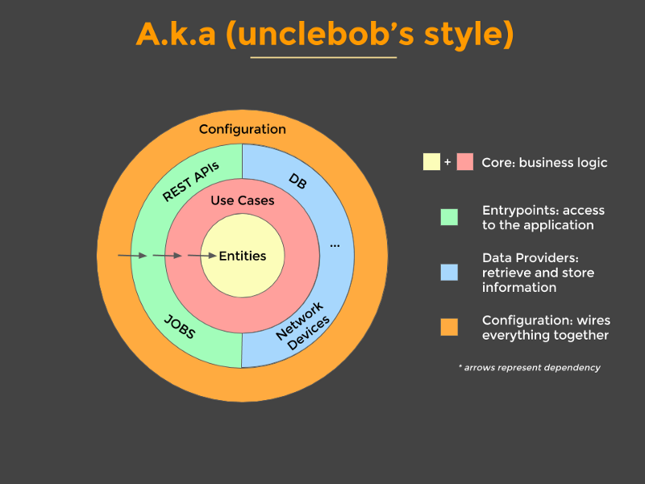

# Especificação do produto (genérico)

Documento vivo: versão inicial com escopo por **módulos**. Detalhes de telas, regras de negócio e integrações serão incrementados em revisões futuras.

## 1. Visão

Sistema web para **gestão de consultório** (primeiro uso: contexto odontológico), projetado para ser **reutilizável** por consultórios de outras áreas mediante configuração (marca, cores, textos) e módulos opcionais.

**Objetivos:**

- Interface **componentizada** (React), com primitivos reutilizáveis (botões, navegação, formulários).
- Aparência baseada em **Bootstrap** (via `react-bootstrap`), com **tema global** fácil de alterar (ex.: marsala + cinza no primeiro cliente; outros paletes depois).
- Domínio **neutro** na UI quando possível (“paciente”, “atendimento”, “profissional”, “item”) para não acoplar a um único tipo de clínica.

## 2. Público e premissas

| Premissa | Descrição |
|----------|-----------|
| Usuários | Equipe do consultório (recepção, clínico, administrativo); **papéis iniciais** `admin` e `comum` (ver §5). |
| Acesso | Aplicação web; autenticação obrigatória para área operacional; marketing pode ser público. |
| Dispositivos | Clientes e equipe acessam **também por smartphone**; a UI deve ser **responsiva** e utilizável em telas pequenas (ver §6). |
| Backend | **Não integrar neste primeiro momento.** O API real ficará em repositório separado (mesmo nome do projeto, sufixo `be` em vez de `fe`, no mesmo diretório pai). Até lá, ver §2.1. |

### 2.1 Ordem de trabalho: telas primeiro, dados mockados

- **Prioridade:** evoluir **telas e fluxos no frontend** com **mocks** (dados falsos) para visualização e validação de UX; **depois** integrar com o backend quando o `be` existir e os contratos estiverem definidos.
- **Regra:** cada tela ou feature avançada deve expor dados através de uma **camada de acesso** (serviços/hooks) cuja implementação inicial é **mock** (objetos em memória, JSON estático ou geradores simples), **substituível** por chamadas HTTP sem reescrever componentes de tela.
- **Spec/plan do backend:** vivem no repositório irmão **`instituto-renata-be`** (`docs/SPEC.md`, `docs/PLAN.md`); o frontend continua a poder evoluir com mocks até a API estar disponível.

## 3. Stack técnica (alvo)

- **Node + npm** para tooling.
- **Vite + React + TypeScript**.
- **Bootstrap 5** + **react-bootstrap**.
- **React Router** para rotas.
- **Tema:** variáveis CSS (ou camada SCSS) centralizadas para cores e tokens; sem cores hardcoded em componentes de negócio.
- **Dados (fase atual):** mocks centralizados por domínio (ex.: `src/mocks/` ou `src/services/mock/`) e tipos TypeScript compartilhados, para troca futura por `fetch`/client HTTP.
- **Layout responsivo:** grid e utilitários do **Bootstrap** (breakpoints, `Container` fluid, navbar colapsável, etc.) para **mobile-first** onde fizer sentido; nenhuma tela crítica pode depender só de viewport largo.

*(Ajustes finos de biblioteca podem ser registrados no repositório à medida que o projeto for criado.)*

### 3.1 Variáveis de ambiente e URL base da API (backend local vs produção)

- O frontend deve obter a **URL base** do backend **apenas** via **variáveis de ambiente** injetadas em **build time** pelo Vite, de forma a alternar **desenvolvimento local**, **staging** e **produção** sem alterar código de negócio.
- **Convenção Vite:** apenas variáveis com prefixo **`VITE_`** são expostas ao bundle do browser.
- **Variável obrigatória (recomendada):** **`VITE_API_BASE_URL`** — URL absoluta do serviço API **sem** barra final (ex.: `http://localhost:8080` com backend local; `https://api.cliente.com` em produção). Todas as chamadas HTTP aos endpoints (ex.: prefixo `/api/v1/...` acordado com o `instituto-renata-be`) devem **concatenar** paths a esta base.
- **Ficheiros:** `.env.development`, `.env.production` e, se necessário, `.env.local` (gitignored para segredos locais); **`.env.example`** na raiz do repositório lista as chaves com valores placeholder — **sem** credenciais reais versionadas.
- **Implementação:** centralizar leitura num módulo único (ex.: `src/config/env.ts`) que usa `import.meta.env.VITE_API_BASE_URL`; **proibido** espalhar URLs literais da API em componentes. Enquanto a integração for só mock, o valor pode ser vazio ou apontar para um stub documentado no código.
- **Segurança:** tokens, segredos e chaves privadas **não** devem ir em variáveis `VITE_*` (ficam expostas no JavaScript público). Usar `VITE_*` apenas para **origem pública** da API. Autenticação (cookies `HttpOnly`, header `Authorization`, etc.) segue o contrato definido com o backend.
- **Nota:** perfis de ambiente, persistência e segredos do **serviço de API** são responsabilidade do repositório **`instituto-renata-be`** (ver o spec desse repositório). Isto é **independente** de `VITE_API_BASE_URL`, que só define **para qual host/porta o browser envia** os pedidos HTTP.

### 3.2 Arquitetura (Clean Architecture)

O sistema de API no repositório irmão segue a **Clean Architecture** (Robert C. Martin): separação em camadas, **regra de dependência** (código de negócio no centro; dependências apontam para dentro) e independência de frameworks e de detalhes de infraestrutura.

**Diagrama de referência** (estilo “anéis”, Uncle Bob):

**Legenda do diagrama:**

| Camada | Papel |
|--------|--------|
| **Core (Entities + Use Cases)** | Lógica de negócio: entidades e casos de uso; não conhece HTTP, BD nem UI. |
| **Entrypoints** (ex.: REST, jobs) | Pontos de entrada à aplicação: adaptam pedidos externos para os casos de uso. |
| **Data providers** (ex.: BD, rede, …) | Implementações que **obtêm e persistem** dados; implementam interfaces definidas no core. |
| **Configuration** | Composição, injeção de dependências e arranque: “liga” camadas sem acoplar o domínio a detalhes. |

**Regra de dependência:** as setas representam **dependências** no código; o interior (**Entities**, **Use Cases**) não depende do exterior.

**Neste repositório (frontend React)** o mapeamento recomendado é coerente com o mesmo princípio:

| Camada Clean (ideia) | Onde no `fe` |
|-------------------|-------------|
| Entities / regras puras | Tipos e funções de domínio sem React/HTTP (ex.: `src/types/`, utilitários de negócio). |
| Use cases | Hooks ou serviços que orquestram fluxos (`src/app/auth/`, `src/mocks/` ou futuros `services/` que chamam portas). |
| Data providers | Implementações **mock** hoje; amanhã clientes HTTP/`fetch` contra `VITE_API_BASE_URL`, atrás dos mesmos contratos. |
| Entrypoints | Rotas, páginas e componentes que disparam ações (`src/pages/`, `AppRoutes`, formulários). |
| Configuration | `main.tsx`, providers (`ThemeProvider`, `AuthProvider`), `src/config/env.ts`, registo de rotas. |

**Nota:** a **linguagem ou stack** do repositório `instituto-renata-be` não é prescrita neste documento; o contrato relevante para o frontend é **HTTP + contratos de dados** (ver spec do `be`).

## 4. Módulos e escopo por feature

Cada módulo abaixo é uma **parte do projeto** com fronteiras claras (pastas `features/<nome>` + rotas). Telas listadas são **principais**; novas telas serão acrescentadas nas próximas versões deste spec.

### 4.1 Autenticação — Login

**Propósito:** entrada segura na aplicação (sessão/token a definir com o backend).

**Escopo inicial (UI):**

- Tela de login (identificador + senha; “esqueci senha” pode ser link placeholder).
- Redirecionamento pós-login para área logada (dashboard ou home do CRM conforme rota padrão).
- Tratamento de erros genérico (credenciais inválidas, indisponibilidade).

**Fora do escopo inicial:** SSO, MFA, cadastro self-service (registrar em backlog se necessário).

---

### 4.2 Marketing (site institucional / captura)

O módulo **marketing** no pacote do tenant pode incluir: **(A)** telas **internas** após login (campanhas, metas, acompanhamento) e **(B)** páginas **públicas** sem login. O `PLAN.md` trata **A** e **B** como subentregas da mesma fase (7.1 e 7.2).

#### (A) Área logada — campanhas e metas

**Propósito:** acompanhar metas e campanhas comerciais no painel (rota típica `/app/marketing`).

**Escopo inicial (UI):** visão anual/mensal, lista ou tabela de campanhas com progresso; ações e persistência reais dependem de API (até lá, mocks).

#### (B) Site público

**Propósito:** páginas **públicas** de divulgação do consultório (ou produto white-label), sem exigir login.

**Escopo inicial (UI):**

- Landing ou home marketing (hero, serviços genéricos, contato).
- Opcional: página “Sobre”, “Contato” com formulário (envio real depende de API).
- Mesmo sistema de tema (cores/tipografia) da área logada para consistência de marca.

**Notas:** conteúdo e SEO podem evoluir; manter textos e blocos como dados ou componentes parametrizáveis facilita multi-cliente.

---

### 4.3 CRM

**Propósito:** relacionamento com **pessoas** (pacientes, leads, contatos) e histórico de interações em nível comercial/atendimento.

**Escopo inicial (UI) — genérico:**

- Lista de contatos / cadastros com busca e filtros básicos.
- Ficha de detalhe (dados cadastrais, tags ou status, linha do tempo de interações — pode começar simplificado).
- Cadastro/edição de registro.

**Notas:** “Paciente” vs “lead” pode ser modelado como tipo de contato ou estágio; detalhar no spec quando o domínio estiver fechado.

---

### 4.4 Vendas

**Propósito:** apoio a **propostas, orçamentos e fechamento** (valores, status, vínculo a contatos).

**Escopo inicial (UI) — genérico:**

- Lista de oportunidades/orçamentos (tabela ou cards) com status (ex.: rascunho, enviado, aceito, perdido).
- Detalhe de uma venda/orçamento (itens, totais, responsável).
- Fluxo mínimo de criação/edição (itens linha a linha podem ser incremento posterior).

**No frontend (dados mock, ver `PLAN.md` Fase 8):** o módulo **Vendas** já expõe telas iniciais para **Transações**, **Leads**, **Pipeline** (quadro tipo Kanban), **Vendedores** e **Produtos & Precificação** (rotas sob `/app/vendas/...`); outras entradas de menu podem permanecer em placeholder até haver referência ou API.

**Notas:** integração com pagamento e NF é backend; UI prevê apenas pontos de extensão (ex.: botão “registrar pagamento” desabilitado até haver API).

---

### 4.5 Estoque

**Propósito:** controle de **itens** (materiais, produtos para uso clínico ou revenda) e movimentações.

**Escopo inicial (UI) — genérico:**

- Lista de itens (nome, SKU opcional, quantidade atual, unidade).
- Detalhe do item e movimentações (entrada/saída/ajuste) — pode iniciar com lista simples de movimentos.
- Tela de ajuste ou movimentação rápida.

**Notas:** regras de lote/validade e integração com compras podem ser fases futuras.

---

## 5. Licenciamento por features e papéis de usuário (RBAC)

O sistema será vendido **por pacotes**: cada cliente habilita apenas os **módulos contratados**. Em paralelo, o acesso dentro dos módulos habilitados depende do **papel** do usuário. Isso reforça a arquitetura **componentizada** e rotas **registradas de forma central**, com guardas explícitas — não apenas “esconder botão”, mas **bloquear URL** e lazy-load quando fizer sentido.

### 5.1 Features (módulos contratados)

- A lista de módulos **habilitados** para o tenant vem do **backend** (ex.: resposta de `/session`, `/me`, ou configuração pós-login). O front não deve assumir que CRM, Vendas, Estoque etc. existem para todo mundo.
- **Comportamento esperado no front:**
  - **Navegação:** itens de menu / atalhos só para módulos habilitados.
  - **Rotas:** acesso direto por URL a módulo **não** contratado deve resultar em **negação consistente** (ex.: redirecionar para home ou página “módulo indisponível”, nunca tela quebrada ou vazia ambígua).
  - **Código:** cada módulo permanece em `features/<modulo>`; o **mapa rota → feature** fica em um único lugar (ex.: config de rotas) para manutenção fina ao mudar URLs.
  - **Opcional (evolução):** carregamento sob demanda (code-split) apenas de bundles de features habilitadas.

**Identificadores de feature** (nomes estáveis para código e API; ajustáveis na convenção do backend):

| Chave sugerida | Alinhamento com módulos do spec |
|----------------|----------------------------------|
| `marketing` | §4.2 (se aplicável ao pacote; pode ser sempre público com escopo separado) |
| `crm` | §4.3 |
| `vendas` | §4.4 |
| `estoque` | §4.5 |

*(Outras features podem ser acrescentadas conforme novos módulos; manter tabela no spec ao evoluir.)*

### 5.2 Papéis (roles)

- Papéis iniciais: **`admin`** e **`comum`** (nome em código em inglês, ex.: `admin` | `common`, para alinhar a JWT/claims comuns; rótulos na UI em português).
- **Fonte de verdade:** o backend define o papel do usuário; o front aplica **autorização de UI e rotas** para experiência correta; **sempre** repetir regras críticas no servidor.
- **Comportamento esperado no front:**
  - Rotas ou telas **somente admin** (ex.: certas configurações) ficam bloqueadas para `comum`.
  - Ações dentro de um módulo (ex.: excluir registro, aprovar venda) podem depender do papel; botões inexistentes ou desabilitados + **guarda na rota/ação** quando aplicável.
- **Detalhamento** de quais telas/ações são `admin` vs `comum` será incrementado neste documento (matriz futura).

### 5.3 URLs e combinação feature + role

- Toda rota protegida deve declarar **quais features** e **quais roles** permitem acesso (interseção: feature habilitada **e** papel suficiente).
- Alterações de path (URLs) devem ser feitas no **registro central** de rotas para não deixar links mortos ou bypass de guarda.

---

## 6. Requisitos transversais

| Área | Requisito |
|------|-----------|
| Layout | Área logada com shell comum (navegação lateral ou superior); marketing pode usar layout próprio sem sidebar administrativa. **Em todos os fluxos:** navegação e conteúdo utilizáveis em **largura estreita** (celular). |
| Responsivo | **Obrigatório:** interfaces usáveis em **smartphone** (toque, leitura, formulários, tabelas com rolagem ou padrão adaptado). Validar em viewports típicas (ex. ~360px de largura) ao entregar telas. |
| Componentes | Botões, barras de navegação, modais, formulários vêm de `components/` (wrappers sobre Bootstrap quando fizer sentido). |
| Tema | Cores e tokens definidos em um único lugar; troca de paleta para outro cliente sem varrer telas. **Modo claro/escuro:** o utilizador pode alternar **light / dark** globalmente (toggle acessível em todas as telas); preferência persistida (ex.: `localStorage`) e aplicada via atributo/CSS (ex.: `data-bs-theme`), incluindo ajustes da tela de login (PLAN **Fase 5**). A **tela de início** logada (dashboard em `/app`) segue o PLAN **Fase 6** (prioridade em relação ao site marketing público — PLAN **Fase 7**). As **primeiras telas** de cada módulo logado (CRM, Vendas, Estoque, etc.), alinhadas a referência visual, seguem o PLAN **Fase 8**; evolução para CRUD e fluxos completos — **Fases 9–11**. |
| Acessibilidade | Meta: contraste e foco utilizáveis; detalhar checklist depois. |
| Internacionalização | Desejável deixar textos preparados para tradução (decisão de lib em fase de setup). |
| Features e roles | Conforme §5: menu, rotas e ações respeitam módulos contratados e papel do usuário. |
| Dados e API | Conforme §2.1: **mocks até integração**; autenticação e listagens usam implementações falsas alinhadas aos tipos. Após integração, o cliente HTTP usa **`VITE_API_BASE_URL`** (§3.1) para apontar ao backend **local** ou **produtivo** conforme o ambiente de build. |
| Changelog e README | **`CHANGELOG.md`:** registrar mudanças notáveis por versão (desenvolvimento ou produção), conforme §7.1. **`README.md`:** a secção de **funcionalidades voltada ao cliente** só deve listar o que estiver **em produção** para o cliente; trabalho ainda em desenvolvimento **não** entra aí (ver §7.1). |

## 7. Processo de atualização (spec, plan, código, changelog e README para produção)

Quando novas informações forem incorporadas a este documento e ao `PLAN.md`:

1. **Atualizar** `SPEC.md` e `PLAN.md` de forma consistente com as decisões acordadas.
2. **Verificar o repositório:** se o trecho alterado no spec/plan **já estiver implementado** no código de outra forma, **registrar explicitamente** que é necessário **alinhar o código** ao novo documento (ou justificar exceção).

### 7.1 Changelog e README

**`CHANGELOG.md`**

- Atualizar quando houver **versão ou entrega** com mudanças notáveis (novas telas, refactors relevantes, correções), inclusive durante o desenvolvimento — é o histórico técnico do repositório.

**`README.md`**

- A secção destinada a **funcionalidades para o cliente** (ou equivalente) deve incluir **apenas** o que estiver **disponível em produção** para o cliente (deploy entregue, uso real).
- **Não** listar aí features ainda em desenvolvimento, só em branch, ou apenas em ambiente de testes interno — isso fica no changelog, issues ou documentação de sprint, conforme o fluxo do time.

Assim o README permanece um resumo fiel do que o cliente pode usar; o changelog preserva o histórico completo de evolução do código.

## 8. Backlog explícito (não priorizado)

Itens para incrementar o spec depois: **matriz fina de permissões** além de admin/comum, prontuário clínico, agenda avançada, relatórios, integrações (WhatsApp, e-mail), multi-unidade.

## 9. Histórico de revisões

| Data | Alteração |
|------|-----------|
| *(inicial)* | Versão base com módulos Login, Marketing, CRM, Vendas, Estoque. |
| 2026-04-17 | §2 dispositivos/mobile; §3 layout responsivo; §5 RBAC; §6 Tema (claro/escuro + PLAN Fase 5); §7/§7.1. |
| 2026-04-18 | §6 alinhado ao PLAN: Fase 6 = dashboard `/app`; marketing público = Fase 7; demais fases renumeradas no `PLAN.md`. |
| 2026-04-18 | §2.1: referência ao `instituto-renata-be` (`docs/SPEC.md` / `docs/PLAN.md`). |
| 2026-04-19 | §3.1: variável `VITE_API_BASE_URL` para URL base da API (local vs produção); §6 tabela Dados e API. |
| 2026-04-19 | §6 Tema: referência ao PLAN **Fase 8** (telas iniciais por módulo) e **Fases 9–11** (módulos profundos). |
| 2026-04-19 | §3.1: nota ao backend sem stack ou BD prescritos no FE; **§3.2** Clean Architecture (diagrama, legenda, mapeamento no React); `docs/assets/clean-architecture-uncle-bob.png`; README e PROMPT. |
